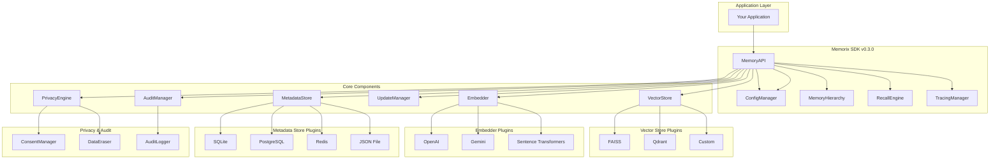
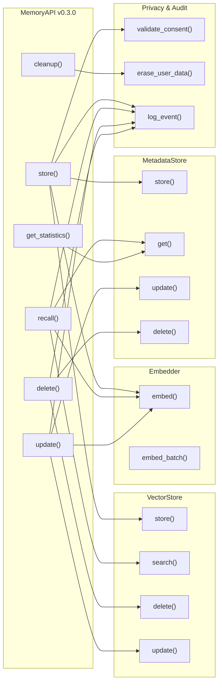
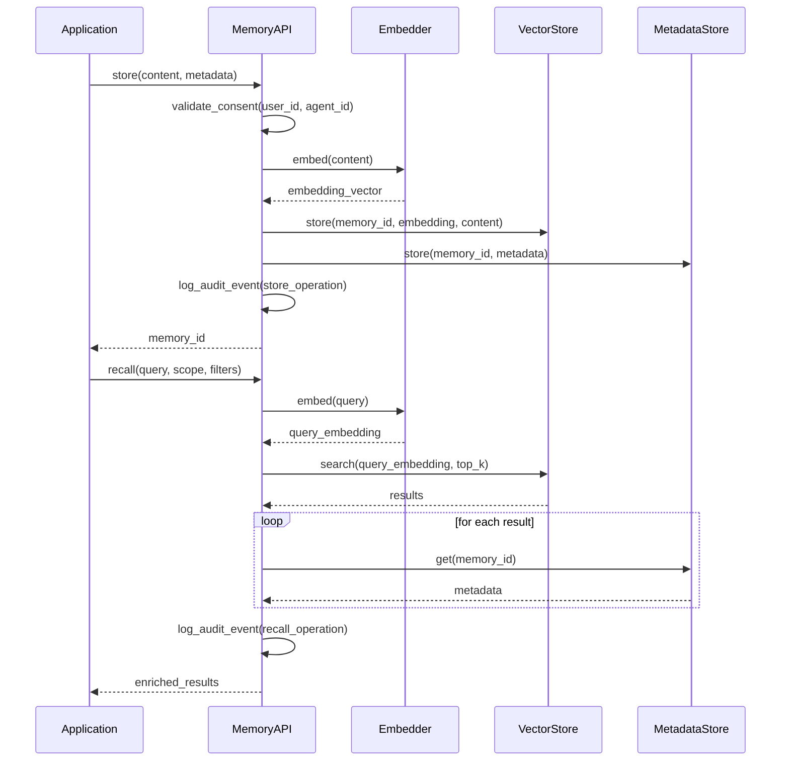
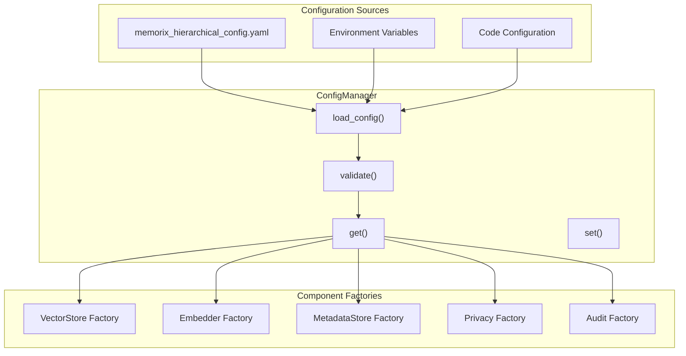
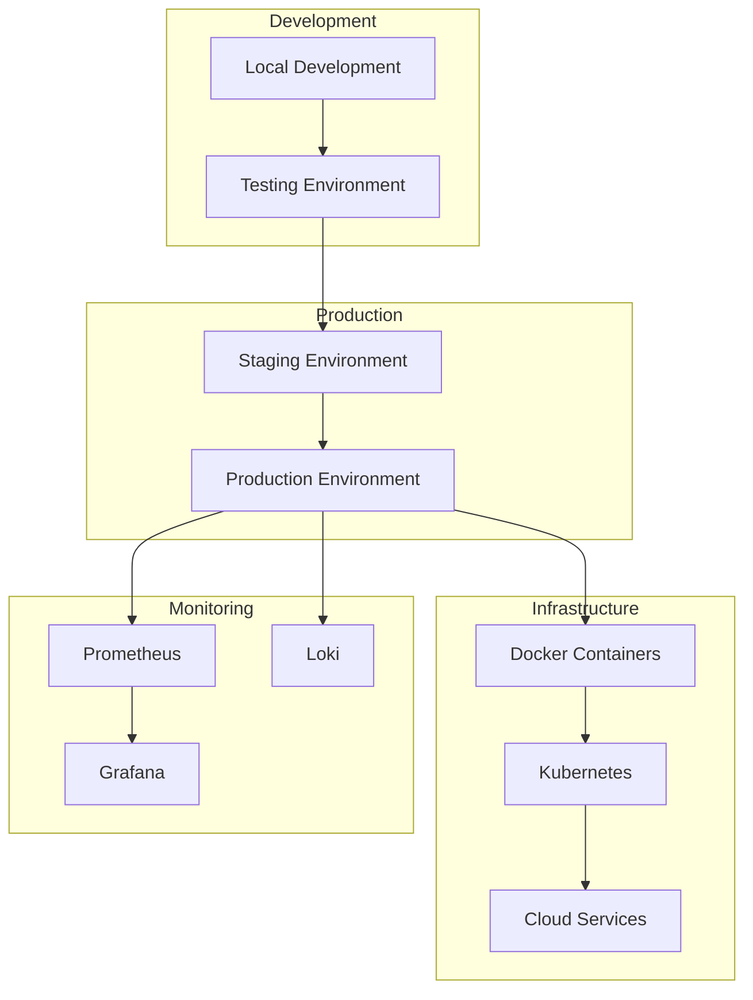

# 🏗️ Memorix SDK Architecture v0.3.0

## High-Level Architecture



## Component Architecture



## Data Flow



## Configuration Architecture



## Key Design Patterns

### 🔌 **Factory Pattern**
- Component factories create appropriate implementations based on configuration
- Easy to add new vector stores, embedders, and metadata stores

### 🎯 **Strategy Pattern**
- Different algorithms for similarity search, embedding generation, and metadata storage
- Runtime selection based on configuration

### 📋 **Template Method Pattern**
- Common interface for all component types
- Consistent API across different implementations

### ⚙️ **Configuration Pattern**
- Centralized configuration management with Pydantic validation
- Environment variable support
- YAML-based hierarchical configuration

### 🏗️ **Hierarchical Memory Pattern**
- Multi-tier memory management (STM → MTM → LTM)
- Automatic tier migration based on decay and scoring
- Pluggable decay and scoring strategies

### 🔐 **Privacy-First Pattern**
- Consent validation before any memory operation
- GDPR-compliant data erasure workflows
- Comprehensive audit trails for compliance

### 🎯 **Declarative Query Pattern**
- Structured recall queries with scoped filtering
- Tag-based, time-based, and agent-based filtering
- Semantic search with metadata enrichment

## Performance Considerations

### 🚀 **Optimizations**
- **Lazy Loading**: Components initialized on first use
- **Caching**: Embedding and metadata caching with Redis
- **Batch Operations**: Support for bulk operations
- **Connection Pooling**: Database connection management
- **FIFO Flow**: Efficient memory eviction and tier migration
- **Adaptive Decay**: Context-aware memory retention

### 📊 **Scalability**
- **Horizontal Scaling**: Stateless API design with Kubernetes
- **Vertical Scaling**: Efficient memory usage with tiered storage
- **Load Balancing**: Multiple vector store instances
- **Caching Layers**: Redis integration support
- **Multi-Tenant**: Agent and organization-level isolation
- **Edge Deployment**: Local memory with selective cloud sync

## Security Architecture

### 🔒 **Security Features**
- **API Key Management**: Secure credential handling
- **Input Validation**: Sanitization of all inputs with Pydantic
- **Access Control**: Metadata-based permissions with RBAC
- **Audit Logging**: Comprehensive operation tracking
- **Consent Management**: GDPR Article 7 compliance
- **Data Erasure**: GDPR Article 17 right to be forgotten

### 🛡️ **Best Practices**
- **Environment Variables**: No hardcoded secrets
- **HTTPS Only**: Secure API communications with TLS
- **Rate Limiting**: Protection against abuse
- **Data Encryption**: At-rest and in-transit encryption
- **Privacy by Design**: Consent validation before operations
- **Audit Trails**: Immutable logs for compliance

## Kubernetes Deployment Architecture

```mermaid
graph TB
    subgraph "External Clients"
        CLIENTS[Agents / APIs / SDK Calls]
    end
    
    subgraph "API Gateway"
        INGRESS[Ingress (Traefik / NGINX)]
    end
    
    subgraph "Memorix API Server"
        API[FastAPI / Uvicorn]
        AUTH[Authentication]
        ROUTING[Routing]
    end
    
    subgraph "Core Services"
        ORCHESTRATOR[Memory Orchestrator]
        PRIVACY[Privacy/Audit APIs]
    end
    
    subgraph "Storage Layer"
        VECTOR[Vector DB (Pinecone/Weaviate)]
        METADATA[Metadata DB (PostgreSQL)]
        AUDIT_LOG[Audit Log (Loki)]
    end
    
    CLIENTS --> INGRESS
    INGRESS --> API
    API --> AUTH
    API --> ROUTING
    API --> ORCHESTRATOR
    API --> PRIVACY
    
    ORCHESTRATOR --> VECTOR
    ORCHESTRATOR --> METADATA
    PRIVACY --> AUDIT_LOG
```

## Enterprise Deployment Architecture



## Kubernetes Components

### 🔩 **Core Kubernetes Components**

| Component | Description |
|-----------|-------------|
| `memorix-api` | FastAPI app that receives all SDK/API traffic from agents |
| `memorix-core` | Manages memory tiers, routing, decay, vector/meta integration |
| `memorix-privacy` | Handles privacy configs, consent checks, and memory erasure APIs |
| `vector-db` | Pluggable vector store (e.g. Weaviate, Qdrant, Pinecone via service mesh) |
| `metadata-db` | SQL store (PostgreSQL, CockroachDB) for metadata & session configs |
| `audit-logger` | Collects audit logs; shipped via FluentBit → Loki, or S3 |
| `config-server` | Serves memory.yaml and privacy.yaml defaults for multi-tenant setups |

### 🧱 **Helm Chart Structure**

```
memorix-k8s/
├── charts/
│   └── memorix/
│       ├── templates/
│       │   ├── api-deployment.yaml
│       │   ├── orchestrator-deployment.yaml
│       │   ├── privacy-deployment.yaml
│       │   ├── ingress.yaml
│       │   ├── service.yaml
│       │   └── configmap.yaml
│       └── values.yaml
├── secrets/
│   ├── api-secrets.yaml
│   └── pg-creds.yaml
└── README.md
```

### ⚙️ **Key Features for Large Scale**

| Feature | How It's Handled |
|---------|------------------|
| Auto-scaling | HPA on memorix-api and memorix-core via CPU/memory |
| GPU/Embedding Workers | Dedicated embedding-worker pods for large-batch updates |
| Multi-Tenant Namespace | Label-based routing, tenant config loaded from YAML |
| Persistent Volume | For FAISS local store or fallback SQLite |
| Service Mesh | (Optional) Use Istio or Linkerd for policy & observability |
| Secrets | Mounted via sealed-secrets or external Vault |
| Consent + Audit | Real-time logs sent to Loki, memory wipe jobs run as Cron |
| Cold Storage | Offloaded to S3 or GCS via memory-archival jobs |

### 🌐 **External Connections**
- **Agents** → via SDK or API → Ingress + `/v1/memory/...` routes
- **S3 / GCS** → used by memory snapshot jobs or LTM backups
- **Kafka / NATS** → optional message bus for event replay, memory triggers
- **LangChain / RAG Frameworks** → integrate through `/recall` and `/query` endpoints

### 🔐 **Security**
- **JWT or OAuth2** agent auth
- **TLS termination** at ingress
- **RBAC** per org/agent
- **GDPR hooks** on all memory writes/reads

### 🧪 **Dev/Test Setup**

```bash
kubectl create ns memorix
helm install memorix charts/memorix/ -n memorix
kubectl port-forward svc/memorix-api 8000:80 -n memorix
```

## Integration Points

### 🔗 **External Services**
- **Vector Databases**: FAISS, Qdrant, Pinecone, Weaviate
- **Embedding APIs**: OpenAI, Google, Cohere, Hugging Face
- **Storage**: SQLite, PostgreSQL, Redis, S3
- **Monitoring**: Prometheus, Grafana, Loki, ELK Stack

### 🔌 **Framework Integrations**
- **Web Frameworks**: FastAPI, Flask, Django
- **AI Frameworks**: LangChain, LlamaIndex, Transformers
- **Cloud Platforms**: AWS, GCP, Azure
- **Orchestration**: Airflow, Prefect, Dagster 