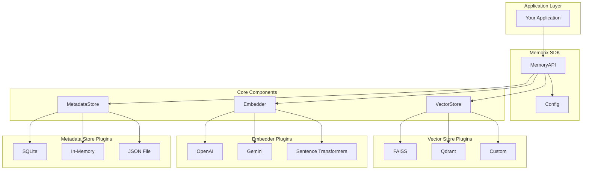
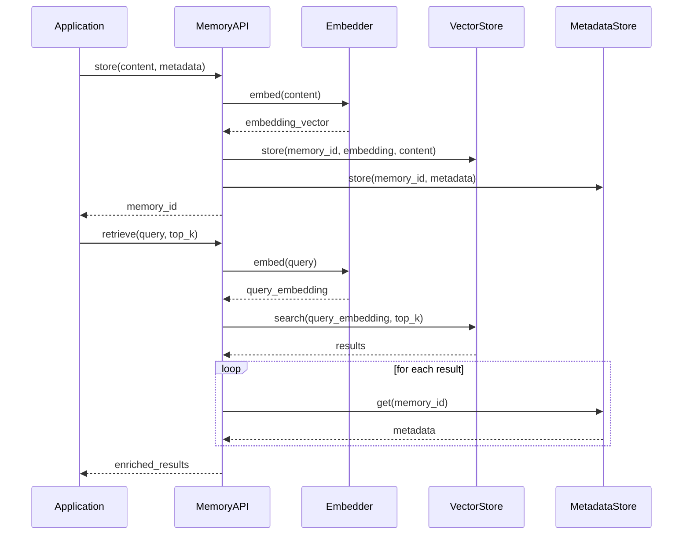
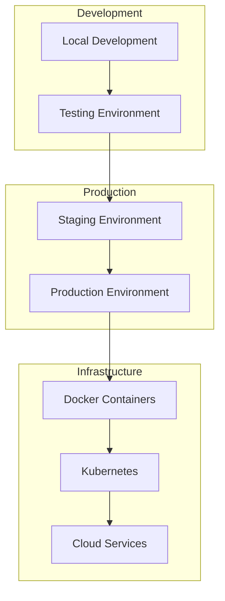

# 🏗️ Memorix SDK Architecture

## High-Level Architecture



## Component Architecture

```mermaid
graph LR
    subgraph "MemoryAPI"
        STORE[store()]
        RETRIEVE[retrieve()]
        UPDATE[update()]
        DELETE[delete()]
        LIST[list_memories()]
    end
    
    subgraph "VectorStore"
        VS_STORE[store()]
        VS_SEARCH[search()]
        VS_DELETE[delete()]
        VS_UPDATE[update()]
    end
    
    subgraph "Embedder"
        EMB_EMBED[embed()]
        EMB_BATCH[embed_batch()]
    end
    
    subgraph "MetadataStore"
        MS_STORE[store()]
        MS_GET[get()]
        MS_UPDATE[update()]
        MS_DELETE[delete()]
    end
    
    STORE --> VS_STORE
    STORE --> EMB_EMBED
    STORE --> MS_STORE
    
    RETRIEVE --> EMB_EMBED
    RETRIEVE --> VS_SEARCH
    RETRIEVE --> MS_GET
    
    UPDATE --> EMB_EMBED
    UPDATE --> VS_UPDATE
    UPDATE --> MS_UPDATE
    
    DELETE --> VS_DELETE
    DELETE --> MS_DELETE
```

## Data Flow



## Configuration Architecture

```mermaid
graph TD
    subgraph "Configuration Sources"
        YAML[memorix.yaml]
        ENV[Environment Variables]
        CODE[Code Configuration]
    end
    
    subgraph "Config Manager"
        LOAD[load_config()]
        VALIDATE[validate()]
        GET[get()]
        SET[set()]
    end
    
    subgraph "Component Factories"
        VS_FACTORY[VectorStore Factory]
        EMB_FACTORY[Embedder Factory]
        MS_FACTORY[MetadataStore Factory]
    end
    
    YAML --> LOAD
    ENV --> LOAD
    CODE --> LOAD
    
    LOAD --> VALIDATE
    VALIDATE --> GET
    GET --> VS_FACTORY
    GET --> EMB_FACTORY
    GET --> MS_FACTORY
```

## Key Design Patterns

### 🔌 **Factory Pattern**
- Component factories create appropriate implementations based on configuration
- Easy to add new vector stores, embedders, and metadata stores

### 🎯 **Strategy Pattern**
- Different algorithms for similarity search, embedding generation, and metadata storage
- Runtime selection based on configuration

### 📋 **Template Method Pattern**
- Common interface for all component types
- Consistent API across different implementations

### ⚙️ **Configuration Pattern**
- Centralized configuration management
- Environment variable support
- Validation and defaults

## Performance Considerations

### 🚀 **Optimizations**
- **Lazy Loading**: Components initialized on first use
- **Caching**: Embedding and metadata caching
- **Batch Operations**: Support for bulk operations
- **Connection Pooling**: Database connection management

### 📊 **Scalability**
- **Horizontal Scaling**: Stateless API design
- **Vertical Scaling**: Efficient memory usage
- **Load Balancing**: Multiple vector store instances
- **Caching Layers**: Redis integration support

## Security Architecture

### 🔒 **Security Features**
- **API Key Management**: Secure credential handling
- **Input Validation**: Sanitization of all inputs
- **Access Control**: Metadata-based permissions
- **Audit Logging**: Operation tracking

### 🛡️ **Best Practices**
- **Environment Variables**: No hardcoded secrets
- **HTTPS Only**: Secure API communications
- **Rate Limiting**: Protection against abuse
- **Data Encryption**: At-rest and in-transit encryption

## Deployment Architecture



## Integration Points

### 🔗 **External Services**
- **Vector Databases**: FAISS, Qdrant, Pinecone, Weaviate
- **Embedding APIs**: OpenAI, Google, Cohere, Hugging Face
- **Storage**: SQLite, PostgreSQL, Redis, S3
- **Monitoring**: Prometheus, Grafana, ELK Stack

### 🔌 **Framework Integrations**
- **Web Frameworks**: FastAPI, Flask, Django
- **AI Frameworks**: LangChain, LlamaIndex, Transformers
- **Cloud Platforms**: AWS, GCP, Azure
- **Orchestration**: Airflow, Prefect, Dagster 